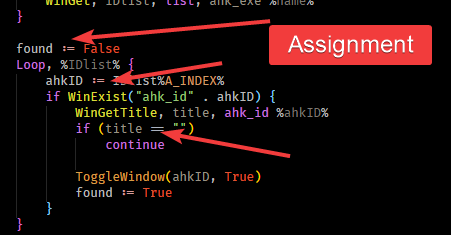

# ✨ Changelog

## 🕰️ Deprecated info added \(1.1.3\)

- 📢 This extension is deprecated, please use [AutoHotkey Plus Plus](https://marketplace.visualstudio.com/items?itemName=mark-wiemer.vscode-autohotkey-plus-plus)

## 👁️ More visual assign operator \(1.1.2\)

- ✨ Assignment operator are colorized
- ➕ `new` and some other keyword support is added
- 👨‍🔧 Some improvement about function arguments colorization

