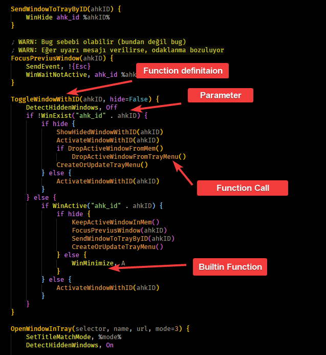
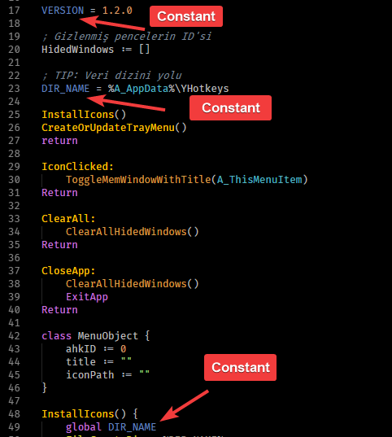
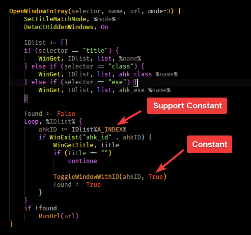

# ✨ YAutoHotkey-VsCode

🤝 AutoHotkey support for VsCode

## 🍱 Included

- ✨ Syntax highlight
- 💫 Codesnippets
- 💬 Comments

## 🚀 What's More

* Supported theme is [🖤 DarkCode Theme](https://marketplace.visualstudio.com/items?itemName=yedhrab.darkcode-theme-adopted-python-and-markdown)
* These screenshots are taken from [🌱YHotkeys](https://github.com/yedhrab/YHotkeys)

## 💖 Support & Contact

​[​​](https://github.com/yedhrab) [​​](https://www.linkedin.com/in/yemreak/) [​​](https://yemreak.com/) [​​](mailto::yedhrab@gmail.com?subject=YBilgiler%20%7C%20Github)​

​[​](https://www.patreon.com/yemreak/)

## 🔏 License

**The** [**MIT License**](https://choosealicense.com/licenses/mit/) **© Yunus Emre Ak**

> This theme is enchaned version of [vscode-autohotkey](https://github.com/stef-levesque/vscode-autohotkey)

